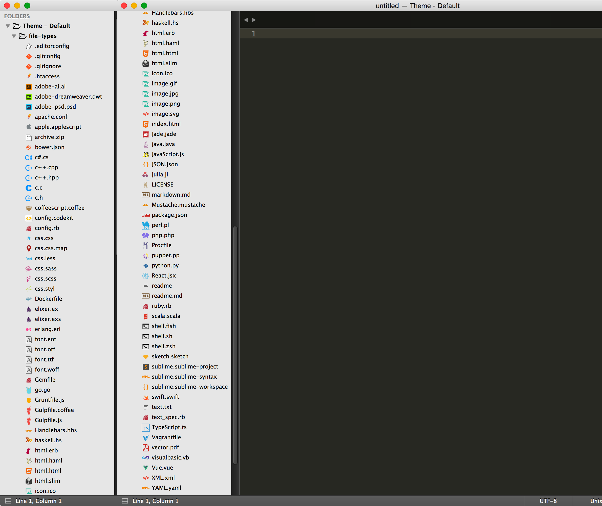

# Sublime Text Default Theme width Side Bar Icons

This is not Package. Sublime Text 3 only.

When using Sublime Default Theme, Add sidebar icons.

## Install

### Manualy

1. Hit a `⌘+,` or menu item `Preferences -> Settings - User`. Preferences.sublime-settings `"theme": "Default.sublime-theme",`. 
2. [Download the .zip](https://github.com/sou-lab/Sublime-Text-Default-Theme-Side-Bar-Icons/archive/master.zip).
3. Unzip and Copy the folder into `Packages/User` directory, which you can find using the menu item `Preferences -> Browse Packages...` in Sublime Text.
4. rename the unzipped folder to "Theme - Default"

### Command Line

    $ cd ~/Library/Application\ Support/Sublime\ Text\ 3/Packages/User/
    $ git clone https://github.com/sou-lab/Sublime-Text-Default-Theme-Side-Bar-Icons "Theme - Default"

# Notes
- Most of the icons I took from [SetiUI-Icons-Sublime](https://github.com/mrmartineau/SetiUI-Icons-Sublime),[Material Theme](https://github.com/equinusocio/material-theme), [sublime-text-sidebar-icons](https://github.com/mrliptontea/sublime-text-sidebar-icons), some are slightly modified and some are I drew myself.
- There is a folder included with some files types from `jesseweed` and `DanBrooker` to test the icons.
- Anything less than 'ST3 Build 3107' wont get the sidebar icons to work.

